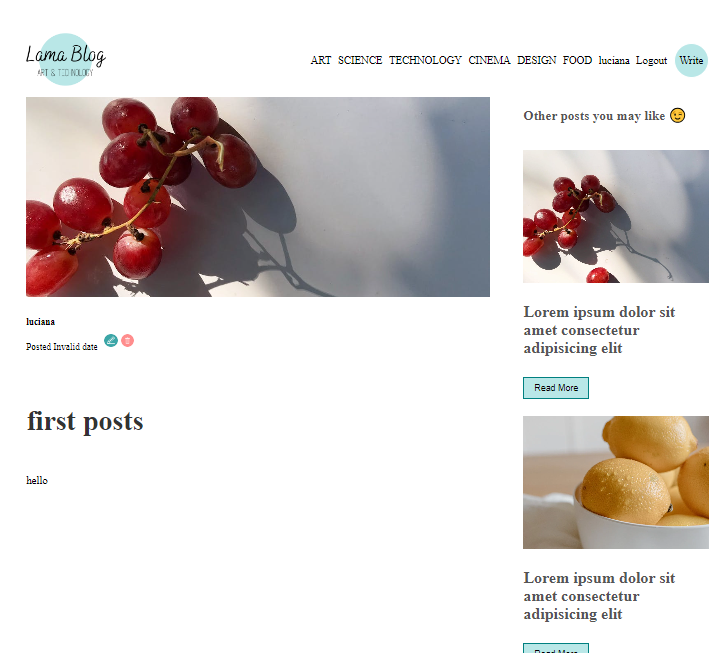
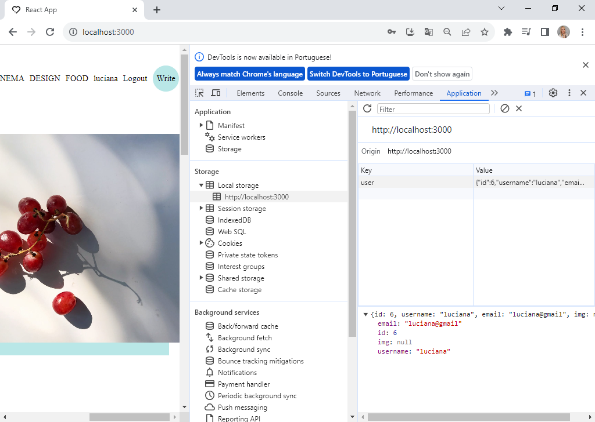
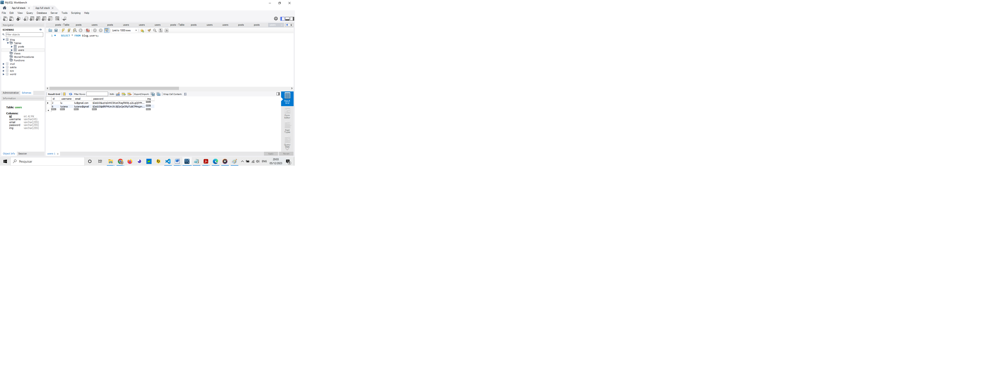
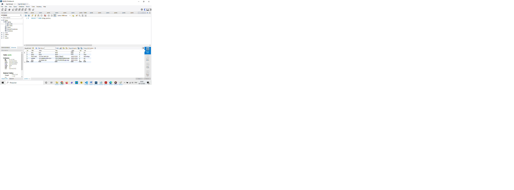

<h1 align="center"> 💻 # Blog Post APP </h1>

## http://localhost:3000/

 

## http://localhost:3000/login

 

## http://localhost:3000/logout

 

## SQL_users

 

## SQL_posts

 

### About Project: 

 Project on integrating React, Node.js, and MySQL to develop a full-stack application. It covers the deployment of a server with crucial middleware, routes, and controllers using the Express framework. You have learned how to establish a connection from the server to the database and perform CRUD (Create, Read, Update, Delete) operations from the client to the server.
 
  Blogging has become an essential tool for individuals and organizations alike to share their thoughts, opinions, and knowledge with the world. With the advancement of technology, creating and managing a blog has become easier than ever. 

In this post, we will discuss how to build a blog post app using React, Node.js and MySQL. React is a popular front-end JavaScript library for building user interfaces, while Node.js is a powerful back-end JavaScript runtime environment that can be used with MySQL, a popular open-source relational database management system to create scalable, robust and efficient web applications.

By combining these technologies, we can create a powerful and dynamic blog post app that will allow users to create, view, and interact with blog posts.

We’ll be creating a database to store posts and user information using MySQL, we’ll use Node.js and Express to create a server that interacts with the database. Next, we’ll build a front-end user interface using React, allowing users to create and edit blog posts.

By the end of this tutorial, you will have gained a solid understanding of how to integrate these technologies to create a fully functional web application. So let’s get started and learn how to build a blog post app with React, Node.js, and MySQL.

## Features

- Authentication: Users can sign up, log in, and log out of the app.
- Authorization: Only authenticated users can create, edit, and delete their own blog posts.
- CRUD Operations: Users can create, read, update, and delete blog posts.
- Pagination: Blog posts are paginated to improve app performance.
- Filter: Blog posts can be filtered by topic.

## Usage

1. Clone the repository:
   `git clone https://github.com/ludiemert/Full_Stack_App.git`

2. Install dependencies (both `api` and `front`)
   `npm install`

3. `npm start` (both `api` and `front`)

## Notes

You need to create a connection with your on MySQL databae and add data.

## Important
This project was created by “Lama Dev,” a passionate developer who shares valuable insights and tutorials on their YouTube channel. You can watch the full tutorial series that inspired this blog post here.

It’s essential to understand that this blog and the associated code were developed with a primary focus on learning and educational purposes. I believe that one of the best ways to truly grasp and internalize knowledge is by explaining it to others. In that spirit, this blog serves as a comprehensive guide to integrating React, Node.js, and MySQL to build a full-stack application.

---

#### 🛠 Tecnologias | Tecnologias
#### The following tools were used in building the project

- [Axios](https://axios-http.com/)
- [ReactJS]( https://pt-br.legacy.reactjs.org/)
- [Node](https://nodejs.org/)
- [MYSQL_Workbench]( https://www.mysql.com/products/workbench/)

#### 📝 Licença

Esse projeto está sob a licença MIT. Veja o arquivo [LICENSE](LICENSE) para mais detalhes.

---

#### ✒️ Authors

 * ** Lama Dev**

- ##### My LinkedIn - 

#### Contact

#### [**Luciana Diemert**](https://github.com/ludiemert)

🛠 `Front-end` `Back-end`Developer Jr.  
📍 São Jose dos Campos – SP - Brazil

&nbsp;
&nbsp;
&nbsp;
&nbsp;

 

